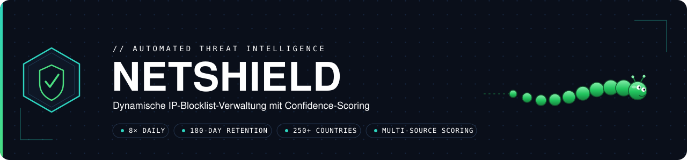

<div align="center">



<br>

[](https://github.com/juergen2025sys/NETSHIELD/actions/workflows/update_combined_blacklist.yml)
[](https://github.com/juergen2025sys/NETSHIELD/actions/workflows/feed_health_monitor.yml)
[](https://github.com/juergen2025sys/NETSHIELD/actions/workflows/update_confidence_blacklist.yml)
[](https://github.com/juergen2025sys/NETSHIELD/actions/workflows/false_positive_checker.yml)

<br>

## ⚡ SCHNELL · 🌍 GLOBAL · 🛡️ AUTOMATISIERT

**Threat-Intelligence aus hunderten Quellen — bewertet, bereinigt und direkt als Firewall-Blocklisten nutzbar.**

   

<br>

[**⚡ Quick Start**](#-quick-start--opnsense-alias) &nbsp; • &nbsp;
[**📊 Blocklisten**](#-blocklisten) &nbsp; • &nbsp;
[**🎯 Scoring**](#-wie-funktioniert-die-bewertung) &nbsp; • &nbsp;
[**🏗️ Architektur**](#%EF%B8%8F-architektur) &nbsp; • &nbsp;
[**⚙️ Workflows**](#%EF%B8%8F-workflows) &nbsp; • &nbsp;
[**📡 Feeds**](#-feed-quellen)

</div>

---

## ⚙️ AUTOMATISIERUNG


> [!TIP]
> **Vollautomatischer Betrieb:** NETSHIELD sammelt, bewertet, filtert und veröffentlicht die IP-Listen über GitHub Actions. Die Kern-Pipeline läuft achtmal täglich.

<details open>
<summary><strong>🔧 Kern-Pipeline anzeigen</strong></summary>

| Workflow | Zeitplan | Aufgabe |
|---|---|---|
| **Update Combined Blacklist** | 8× täglich, alle 3h (00:07, 03:07 … 21:07 UTC; +Backups :27/:47) | Feeds laden, `seen_db` aktualisieren, Combined + Active Blacklists schreiben |
| **Confidence Blacklist** | 8× täglich (01:47, 04:47 … 22:47 UTC) | Confidence40 + Watchlist aus `seen_db` berechnen |
| **False Positive Checker** | 3× täglich (05:00, 13:00, 20:00 UTC) | Whitelist-CIDRs prüfen → `false_positives_set.json` |
| **NETSHIELD Report Generator** | stündlich (:30) | `NETSHIELD_REPORT.md` + README-Statistiken aktualisieren |

</details>

<details>
<summary><strong>📡 Datenquellen-Workflows anzeigen</strong></summary>

| Workflow | Zeitplan | Aufgabe |
|---|---|---|
| **CVE-to-IP Mapper** | täglich 04:00 | C2/Exploit-IPs → `cve_exploit_ips.txt` |
| **Honeypot Monitor** | 4× täglich (05:00, 11:00, 17:00, 23:00) | Honeypot-Feeds → `honeypot_ips.txt` |
| **Honigtopf** | stündlich (:15) | Honigtopf API → `honigtopf_ips.txt` |
| **TweetFeed Monitor** | täglich 02:45 | TweetFeed.live IOCs → `tweetfeed_ips.txt` |
| **Bot-Detector Blacklist** | täglich 22:45 | Bot-IPs → `bot_detector_blacklist_ipv4.txt` |
| **Auto Feed Discovery** | wöchentlich So 04:37 (+Backups 07:23, 11:47) | GitHub nach neuen Feeds durchsuchen |

</details>

<details>
<summary><strong>🔍 Überwachung & Schutz anzeigen</strong></summary>

| Workflow | Zeitplan | Aufgabe |
|---|---|---|
| **Score Decay Monitor** | wöchentlich So 07:00 | Alterungs-Report |
| **Feed Health Monitor** | täglich 01:00 | Feed-URLs auf Erreichbarkeit prüfen |
| **Workflow Health Checker** | 4× täglich | Produktions- und Gesundheitsprüfungen |
| **Workflow Health Report** | alle 6h | Workflow-Status-Report schreiben |
| **Watchdog Combined** | alle 15 min | Combined-Pipeline auf Stillstand überwachen |
| **Watchdog Honigtopf** | 4× pro Stunde | Honigtopf-Workflow überwachen |
| **CodeQL Security Scan** | wöchentlich So 03:00 | Statische Sicherheitsanalyse |
| **Update All Countries IPv4** | Mo + Mi 01:30 | Länder-/Kontinent-Ranges synchronisieren |

</details>

---

## 📊 LIVE-BEDROHUNGSLAGE

 

> [!TIP]
> **Live-Daten:** Die Tabellen darunter werden weiterhin automatisch durch NETSHIELD aktualisiert.

<!-- STATS_TABLE_START -->
<table>
<tr>
<td align="center" valign="top" width="25%">
<h3>286</h3>
<sub>IP-Quellen<br>(dynamisch)</sub>
</td>
<td align="center" valign="top" width="25%">
<h3>722,444</h3>
<sub>Aktive IP-Drohungen<br>(Confidence ≥65)</sub>
</td>
<td align="center" valign="top" width="25%">
<h3>29,367</h3>
<sub>CVE/Exploit IPs<br>&nbsp;</sub>
</td>
<td align="center" valign="top" width="25%">
<h3>1,162,180</h3>
<sub>Honeypot IPs<br>&nbsp;</sub>
</td>
</tr>
</table>
<!-- STATS_TABLE_END -->

<!-- META_TABLE_START -->
<table>
<tr>
<td><strong>🕒 Letztes Update</strong></td>
<td>2026-08-09 12:39 CEST (Europe/Berlin)</td>
<td><strong>🔄 Intervall</strong></td>
<td>8× täglich</td>
</tr>
<tr>
<td><strong>📅 IP-Retention</strong></td>
<td>180 Tage</td>
<td><strong>⚙️ Aktive Workflows</strong></td>
<td>26</td>
</tr>
<tr>
<td><strong>🌍 Abdeckung</strong></td>
<td colspan="3">250+ Länder</td>
</tr>
</table>
<!-- META_TABLE_END -->

> NETSHIELD aggregiert, bewertet und bereinigt täglich IP-Bedrohungsdaten aus **über 160 Quellen** (dynamisch, wächst laufend durch Auto-Discovery): rund 120 öffentliche Remote-Feeds, 6 lokale Sub-Workflow-Feeds (CVE, Honeypot, Honigtopf, Bot-Detector, TweetFeed und laufend neu per GitHub-Discovery entdeckte Feeds. Das System unterscheidet aktive Bedrohungen von veralteten statischen Listen und liefert daraus qualitativ hochwertige Blocklisten für OPNsense, pfSense und iptables.

---


## 🛡️ BLOCKLISTEN-ZENTRALE

 

> [!IMPORTANT]
> **Firewall-ready:** Produktive Listen für Blocking, Monitoring und Audit/SIEM.

| Datei | Zweck | Einträge | Empfohlen für |
|---|---|---:|---|
| 🛡️ [`active_blacklist_ipv4.txt`](active_blacklist_ipv4.txt) | Aktive Bedrohungen · letzte 30 Tage · Score ≥ 65 | **722,444**                                                                                                                                                                                                                                                                                                                                                                                                                                                                                                                                                                                                                                                                                                                                                                                                                                                                                                                                                                                                                                                                                                                                                                                                                                                                                                                                                                                                                                                                                                                                                                                                                                                                                            | OPNsense / pfSense / Firewall |
| 🔶 [`_part1.txt`](blacklist_confidence40_ipv4_part1.txt) · [`_part2.txt`](blacklist_confidence40_ipv4_part2.txt) | Mittleres bis hohes Vertrauen · Score ≥ 40 · 2 Parts | **7,037,961**                                                                                                                                                                                                                                                                                                                                                                                                                                                                                                                                                                                                                                                                                                                                                                                                                                                                                                                                                                                                                                                                                                                                                                                                                                                                                                                                                                                                                                                                                                                                                                                                                                                      | Erweiterte Filterregeln |
| 📦 [`_part1.txt`](combined_threat_blacklist_ipv4_part1.txt) · [`_part2.txt`](combined_threat_blacklist_ipv4_part2.txt) | Alle IPs · 180 Tage · 2 Parts | **8,775,160**                                                                                                                                                                                                                                                                                                                                                                                                                                                                                                                                                                                                                                                                                                                                                                                                                                                                                                                                                                                                                                                                                                                                                                                                                                                                                                                                                                                                                                                                                                                                                                                                                                                                                        | Audit / SIEM |
| 👁️ [`watchlist_confidence25to39_ipv4.txt`](watchlist_confidence25to39_ipv4.txt) | Watchlist · Score 25–39 | **44,636**                                                                                                                                                                                                                                                                                                                                                                                                                                                                                                                                                                                                                                                                                                                                                                                                                                                                                                                                                                                                                                                                                                                                                                                                                                                                                                                                                                                                                                                                                                                                                                                                                                                                           | Monitoring |
| 💣 [`cve_exploit_ips.txt`](cve_exploit_ips.txt) | CVE-Exploits & aktive C2-Server | **29,367**                                                                                                                                                                                                                                                                                                                                                                                                                                                                                                                                                                                                                                                                                                                                                                                                                                                                                                                                                                                                                                                                                                                                                                                                                                                                                                                                                                                                                                                                                                                                                                                                                                                                                            | IDS / IPS |
| 🍯 [`honeypot_ips.txt`](honeypot_ips.txt) | Honeypot-bestätigte Angreifer | **1,162,180**                                                                                                                                                                                                                                                                                                                                                                                                                                                                                                                                                                                                                                                                                                                                                                                                                                                                                                                                                                                                                                                                                                                                                                                                                                                                                                                                                                                                                                                                                                                                                                                                                                                                                            | Ergänzung |
| 🍯 [`honigtopf_ips.txt`](honigtopf_ips.txt) | Honigtopf Community Honeypot (API) | **15,987**                                                                                                                                                                                                                                                                                                                                                                                                                                                                                                                                                                                                                                                                                                                                                                                                                                                                                                                                                                                                                                                                                                                                                                                                                                                                                                                                                                                                                                                                                                                                                                                                                                                                      | Ergänzung |
| 🐦 [`tweetfeed_ips.txt`](tweetfeed_ips.txt) | TweetFeed.live Community IOCs | **9,286**                        | Ergänzung |
| 🤖 [`bot_detector_blacklist_ipv4.txt`](bot_detector_blacklist_ipv4.txt) | Bot- & Scanner-IPs | **1,283,617**                                                                                                                                                                                                                                                                                                                                                                                                                                                                                                                                                                                                                                                                                                                                                                                                                                                                                                                                                                                                                                                                                                                                                                                                                                                                                                                                                                                                                                                                                                                                                                                                                                                                                            | Web-Schutz |
| 🔗 [`reputation_blacklist.txt`](reputation_blacklist.txt) | Reputation Top-IPs (API, Score ≥50) | **9,968**                                                                                                                                                                                                                                                                                                                                                                                                                                                                                                                                                                                                                                                                                                                                                                                                                                                                                                                                                                                                                                                                                                                                                                                                                                                                                                                                                                                                                                                                                                                                                                                                                                                                                            | Ergänzung |

> [!NOTE]
> **Combined-Blacklist (2 feste Parts):** Die vollständige IPv4-Liste wird als genau zwei committete Dateien `combined_threat_blacklist_ipv4_part1.txt` und `combined_threat_blacklist_ipv4_part2.txt` bereitgestellt (IP-sortiert geteilt, je ~48 MB). Diese beiden Parts sind die **kanonische Quelle**. Die frühere Einzeldatei `combined_threat_blacklist_ipv4.txt` wird nicht mehr committet (sie würde das 100-MB-GitHub-Limit pro Datei sprengen); interne Workflows erzeugen sie bei Bedarf im Runner aus den Parts. Firewall-Konsumenten (z. B. OPNsense) importieren die beiden Part-URLs als separate Aliase. Hinweis: Bei fix zwei Parts liegt die harte Obergrenze bei ~200 MB gesamt (2 × 100-MB-Limit); ein Frühwarn-Log meldet, sobald ein Part 90 MB überschreitet.
>
> **Wann kommen keine neuen IPs mehr in die Hauptdatei?** Die Begrenzung erfolgt über die **Dateigröße**, nicht über eine feste IP-Anzahl. Solange die geschätzte Vollgröße unter 100 MB (`HARD_LIMIT_MB`) bleibt, enthält die Hauptdatei **alle** IPs. Sobald sie 100 MB erreichen würde, wird sie auf ~95 MB (`TRUNCATE_TARGET_MB`) gekürzt – bei der aktuellen durchschnittlichen Zeilenlänge (~14,3 Bytes/IP) entspricht das **rund 7 Millionen IPs**. Ab diesem Punkt wächst nur noch die Part-Datei-Reihe; zusätzliche IPs landen ausschließlich in den Parts. **Es gehen dabei keine IPs verloren** – die Parts (und `seen_db`) enthalten stets die vollständige Liste. Die genaue Schwelle verschiebt sich leicht mit der IP-Zusammensetzung (kurze vs. lange Adressen).

<details>
<summary><strong>🌍 Geo-Listen</strong></summary>

```
countries/              →  IPv4-Ranges pro Land, nach Kontinent sortiert
continents/             →  Zusammengefasste Ranges pro Kontinent
all_countries_ipv4.txt  →  Alle Länder in einer Datei
```

</details>

---

## 🎯 VERTRAUENSBEWERTUNG

 

> [!NOTE]
> Jede IP erhält eine nachvollziehbare Bewertung aus **Quellenqualität, Aktualität, Persistenz und Bekanntheitsdauer**.

Jede IP bekommt einen **Confidence-Score (0–100)** aus vier Dimensionen:

```
Score = Quellen-Qualität (40) + Aktualität (30) + Persistenz (20) + Bekannt seit (10)
```

| Dimension | **Gewicht** | Logik |
|---|:---:|---|
| 🏅 Quellen-Qualität | `40` | HQ-Feed = 40 · 5+ Feeds heute = 35 · 3+ heute = 28 · 2+ heute = 20 · 5+ gesamt = 15 · 3+ gesamt = 10 · 2+ gesamt = 5 |
| ⏱️ Aktualität | `30` | Heute = 30 · ≤ 3 Tage = 25 · ≤ 7 Tage = 20 · ≤ 14 Tage = 12 · ≤ 30 Tage = 6 |
| 🔁 Persistenz | `20` | 14+ Tage = 20 · 7 Tage = 15 · 3 Tage = 10 · 2 Tage = 6 · 1 Tag = 2 |
| 📆 Bekannt seit | `10` | 90+ Tage = 10 · 30+ Tage = 6 · 14+ Tage = 3 |

> [!IMPORTANT]
> Nur **HQ-Feeds** (Feodo, AbuseIPDB, Spamhaus, DataPlane, FireHOL u. a.) bestimmen die Lebenszeit einer IP. Statische Mega-Listen erhöhen den Score, können eine IP aber nicht am Leben halten. Nach **180 Tagen** ohne HQ-Bestätigung wird eine IP automatisch entfernt. Watchlist-IPs ohne HQ-Bestätigung laufen bereits nach **30 Tagen** ab.

### 🚦 Bewertungsstufen

| Score | Liste | Verwendung |
|:---:|---|---|
| 🔴 **≥ 65** | `active_blacklist` | Firewall · direktes Blocking |
| 🟠 **≥ 40** | `confidence40` | Erweiterte Regeln |
| 🟡 **25–39** | `watchlist` | Nur Monitoring |
| ⚪ **< 25** | `combined` | Audit / SIEM |

---

## 🏗️ SYSTEM-AUFBAU


```
~120 Quellen · dynamisch (Remote + Lokal + Auto-Discovered)
        │
        ▼
┌─────────────────────────────────────────────┐
│         Update Combined Blacklist           │  ← Haupt-Engine · 8× täglich
│                                             │
│  ┌─────────────┐  ┌──────────────────────┐  │
│  │  seen_db    │  │ False-Positive-Set   │  │
│  │  (Cache)    │  │ (Whitelist-Filter)   │  │
│  └──────┬──────┘  └──────────────────────┘  │
│         │                                   │
│   Score-Berechnung · HQ/Non-HQ Trennung     │
│   IP-Lebenszeit: 180T (HQ) / 30T (Watchlist)│
└──────────┬──────────────────────────────────┘
           │
     ┌─────┼─────────────────┐
     ▼     ▼                 ▼
  active  combined      confidence40
  ≥65     180T          ≥40 / watchlist
    │       │                │
    ▼       ▼                ▼
 OPNsense  Audit/SIEM    Analyse

Sub-Workflows (vor Combined):
  CVE Mapper ──────┐
  Honeypot Monitor ├──→ Lokale .txt-Dateien ──→ Combined liest ein
  Honigtopf        │
  Bot-Detector ────┘

Enrichment (nach Combined):
  Score Decay ─────→ Alterungs-Report (read-only)
```

---


---

## 🕐 DATENFLUSS & ZEITPLAN


```
── Häufig / stündlich (UTC) ───────────────────────────────────
*/15              Watchdog Combined            (Stillstands-Check)
:07/:22/:37/:52   Watchdog Honigtopf           (Stillstands-Check)
:15               Honigtopf  ──────────────────┐  (stündlich)
:30               NETSHIELD Report Generator   │  (stündlich)
                                               │
── Combined-Pipeline · 8× täglich, alle 3h ────┤
00:07,03:07 … 21:07  Update Combined Blacklist ┼──→ seen_db Cache
                     (+Backups :27 / :47)      │
01:47,04:47 … 22:47  Confidence Blacklist ─────┘  (8× täglich)

── Täglich · feste Slots (UTC) ────────────────────────────────
00:05,06:05,12:05,18:05  Workflow Health Report
01:00             Feed Health Monitor
01:15,07:15,13:15,19:15  Workflow Health Checker
01:30 (Mo+Mi)     Update All Countries
02:45             TweetFeed Monitor
03:00 (So)        CodeQL Security Scan
04:00             CVE-to-IP Mapper
04:37 (So)        Auto Feed Discovery (+Backups 07:23, 11:47)
05:00,11:00,17:00,23:00  Honeypot Monitor
05:00,13:00,20:00        False Positive Checker
07:00 (So)        Score Decay Monitor
22:45             Bot-Detector Blacklist
```

---

## 📈 BERICHTE & ÜBERWACHUNG


| Datei | Inhalt |
|---|---|
| 📊 [`NETSHIELD_REPORT.md`](NETSHIELD_REPORT.md) | Gesamtübersicht + Feed Health (alle 30 min) |
| 💚 [`feed_health_report.md`](feed_health_report.md) | Status aller Feed-URLs |
| ⚙️ [`workflow_health_report.md`](workflow_health_report.md) | Workflow-Analyse (Python-Syntax, Cron-Timing, Guards) |
| 🔀 [`combined_threat_blacklist_report.md`](combined_threat_blacklist_report.md) | Feed-Statistik pro Lauf |
| 📉 [`score_decay_report.md`](score_decay_report.md) | Alterungs-Analyse der seen_db |
| 🔎 [`auto_feed_discovery_report.md`](auto_feed_discovery_report.md) | Neu entdeckte Feeds + Bewertung |

---

## 📡 BEDROHUNGSQUELLEN

 

NETSHIELD bezieht Daten aus folgenden Kategorien:

| Kategorie | Beispiele | HQ |
|---|---|:---:|
| Abuse-Tracker | Feodo, ThreatFox, URLhaus (abuse.ch) | ✅ |
| Blocklist-Aggregatoren | FireHOL Level 1–4, blocklist.de, DShield | ✅ |
| Honeypot-Netzwerke | DataPlane, Turris Sentinel, Honigtopf (API) | ✅ |
| Reputation-Feeds | AbuseIPDB (API + Mirrors), ipsum, CINSscore | ✅ |
| C2/Botnet-Tracker | C2-Tracker, MISP C2 Intel Feeds | ✅ |
| Threat Intelligence | Spamhaus DROP, Emerging Threats, Threatview | ✅ |
| Community-Feeds | GitHub-Repos (auto-discovered), Bot-Detector | ❌ |
| Brute-Force-Listen | CrowdSec, danger.rulez.sk, blocklist.de/ssh | ✅ |

> [!IMPORTANT]
> **HQ-Feeds** (rund die Hälfte aller Remote-Quellen) bestimmen die Lebenszeit einer IP. Non-HQ-Feeds erhöhen den Confidence-Score, können IPs aber nicht am Leben halten.

---

## 📁 DATEIEN & STRUKTUR

<details>
<summary><strong>Repository-Layout anzeigen</strong></summary>

```
NETSHIELD/
├── .github/workflows/                   # GitHub Actions Workflows
├── continents/                          # IPv4-Ranges pro Kontinent
├── countries/                           # IPv4-Ranges pro Land
│   ├── africa/ · asia/ · europe/
│   ├── north_america/ · oceania/ · south_america/
│
├── active_blacklist_ipv4.txt            # → Firewall (Score ≥65, 30 Tage)
├── blacklist_confidence40_ipv4_part1.txt  # → Erweiterte Regeln (Score ≥40) – kanonisch, Teil 1/2
├── blacklist_confidence40_ipv4_part2.txt  #   kanonisch, Teil 2/2 (Einzeldatei nicht mehr committet)
├── combined_threat_blacklist_ipv4_part1.txt  # → Audit / SIEM (180 Tage) – kanonisch, Teil 1/2
├── combined_threat_blacklist_ipv4_part2.txt  #   kanonisch, Teil 2/2 (Einzeldatei nicht mehr committet)
├── watchlist_confidence25to39_ipv4.txt  # → Monitoring (Score 25–39)
│
├── cve_exploit_ips.txt                  # CVE/C2-IPs (täglich)
├── honeypot_ips.txt                     # Honeypot-Feeds (täglich)
├── honigtopf_ips.txt                    # Honigtopf API (täglich)
├── tweetfeed_ips.txt                    # TweetFeed.live IOCs (täglich)
├── bot_detector_blacklist_ipv4.txt      # Bot-Detector (täglich)
├── reputation_blacklist.txt          # Reputation API (Round-Robin)
│
├── auto_discovered_feeds.json           # Auto-entdeckte Feeds
├── false_positives_set.json             # FP-Whitelist
├── feed_health_status.json              # Feed-Status
├── seen_db_meta.json                    # seen_db Metadaten (DB im Cache)
│
├── NETSHIELD_REPORT.md                  # Haupt-Dashboard
└── README.md
```

</details>

---

## 🔒 SCHUTZ & AUSFALLSICHERHEIT

 

  

| Mechanismus | Beschreibung |
|---|---|
| 🛑 **Leerungsschutz** | Jeder Workflow prüft MIN_ENTRIES vor dem Schreiben — bei zu wenigen Ergebnissen bleibt die alte Datei erhalten |
| ⚪ **False-Positive-Filter** | Umfangreiche Whitelist (CDN, DNS, Mail, Cloud-Provider) verhindert Blocking legitimer Infrastruktur |
| 🏅 **HQ/Non-HQ-Trennung** | Nur verifizierte HQ-Feeds verlängern die Lebenszeit einer IP — statische Listen können IPs nicht am Leben halten |
| 🔁 **Push-Retry** | 5 Versuche mit git rebase bei gleichzeitigen Commits |
| 🔐 **Concurrency-Lock** | Jeder Workflow läuft max. 1× gleichzeitig |
| 📦 **Cache-Isolation** | Verschiedene Workflows nutzen eigene Cache-Prefixe (v2, fp, afd) |

---

<div align="center">

<sub>*Automatisch aktualisiert · [NETSHIELD_REPORT.md](NETSHIELD_REPORT.md)*</sub>

<sub>[⬆ Nach oben](#-netshield)</sub>

</div>
